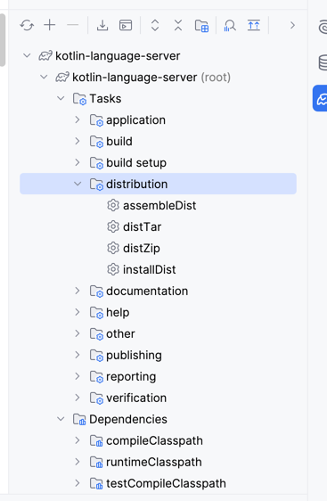

# Development

This guide outlines making changes to the language server and testing it with the [VSCode extension](https://github.com/brexhq/bazel-kotlin-vscode-extension).

Use IntelliJ to open this repository, it should automatically import all the Gradle modules.

## Build/compile the binary

- Run the `./gradlew installDist` task to build a standalone binary of the language server.

- Now, this will build and create the binary file at,
```bash
server/build/install/server/bin/kotlin-language-server
```


## Debugging with VSCode
When you're making changes, you may want to debug it end-to-end with the VSCode extension. You can do so following the below steps:
1. Point the VSCode extension to the locally build language server with
```json
{
    "bazelKLS.kotlinLanguageServer.path": "/Users/smocherla/src/kotlin-language-server/server/build/install/server/bin/kotlin-language-server"
}
```
in the VSCode settings. Then it'll use the language server with your changes rather than one from the releases.

2. Enable the LSP to run with debugging mode
```json
{
    "bazelKLS.kotlinLanguageServer.debugAttach.enabled": true,
    "bazelKLS.kotlinLanguageServer.debugAttach.port": 5006
}
```

This will run the LSP listening on a debugger port 5006.
3. You can now use `Attack to Process` in IntelliJ when VSCode is running and the extension is activated after opening a Kotlin file as seen below.


4. Now, you can set breakpoints and debug the code.


## Functionality:
These are some of the key places changes have been done to support Bazel:

- [BazelClassPathResolver.kt](shared/src/main/kotlin/org/javacs/kt/classpath/BazelClassPathResolver.kt) holds the core logic that extracts the classpath entries (paths to JAR files)
from `bazel-out` that's leveraged by the compiler for syntax highlighting, Go-to-defintion and Hover.
- [SourceFiles.kt](server/src/main/kotlin/org/javacs/kt/SourceFiles.kt) this holds the logic to walk `bazel-out`for files with the pattern `klsp-srcs.txt` with each file
holding a list of paths pointing to source files in the repo. This allows us to track the source files selectively in the repo and not use all of them for compilation, which would use up a lot of CPU/memory.
- [GoToDefinition.kt](server/src/main/kotlin/org/javacs/kt/definition/GoToDefinition.kt) this holds the logic for the Go-to-definition functionality using the source jars extracted from the classpath resolver.
- [Hovers.kt](server/src/main/kotlin/org/javacs/kt/hover/Hovers.kt) includes the logic for Hover, and showing docstrings when hovering over symbols in the codebase.
- [Compiler.kt](server/src/main/kotlin/org/javacs/kt/compiler/Compiler.kt) - includes a wrapper to the Kotlin compiler (k1) to compile sources to produce [ModuleDescriptor](https://javadoc.io/static/org.jetbrains.kotlin/kotlin-compiler/0.7.895/org/jetbrains/jet/lang/descriptors/ModuleDescriptor.html)
and extract symbols from it like classes, functions etc. This is used in many places and across all of the LSP features.
- [Parser.kt](server/src/main/kotlin/org/javacs/kt/sourcejars/Parser.kt) holds classes to parse SourceJars and extract information like line number/position required for Go-to-defintion and extracting docstrings from sources in sourcejars.
